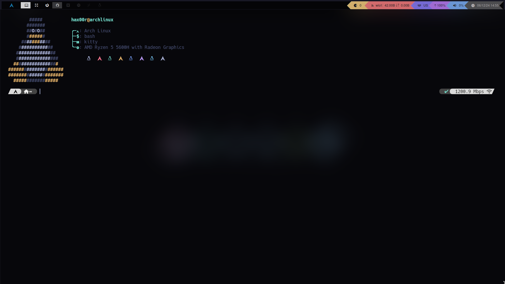
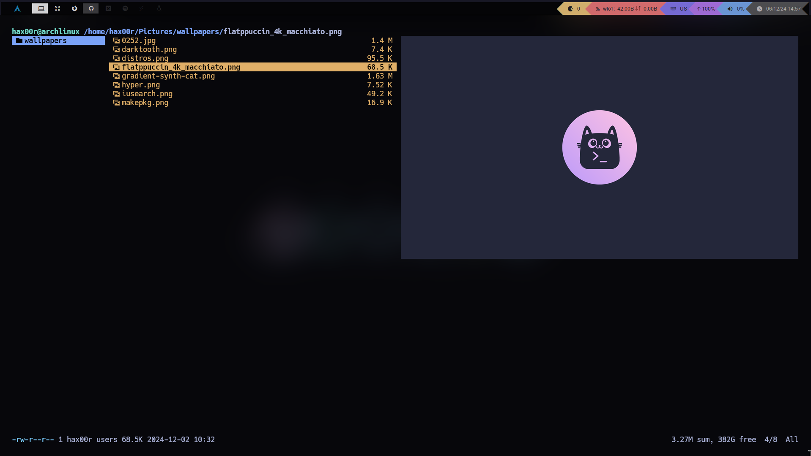

# Q T I L E 

My secure archlinux **qtile** dotfiles with qtile's modified source code to make it easier to manage and more scalable. It also includes an ansible playbook to automate the ricing process. It will install a hardened kernel, mac changer and the Linux Kernel Runtime Guard module.

# ----> T A K E  A  L O O K <----

## DESKTOP

## TERMINAL

## RANGER

## BAR

# F E A T U R E S

- Ansible playbook to automate necessary packages for the environment to work
- Hardened kernel and security features

