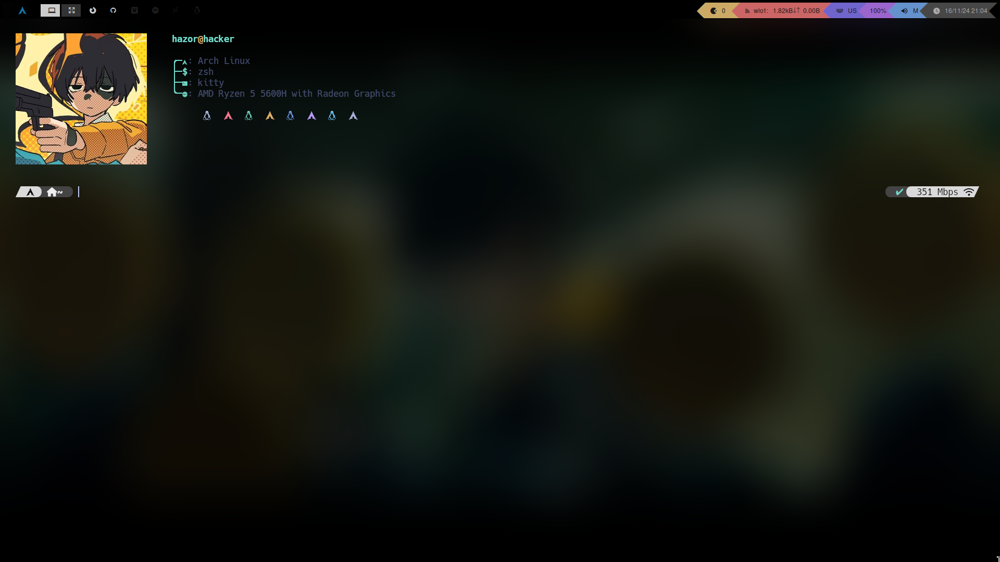

# Q T I L E 

This branch contains my ArchLinux **qtile** dotfiles with modified source code to make it easier to manage and more scalable. Take a look at my **debian** branch to get the debian verion of my dotfiles! Check my [ansible-linux](https://github.com/AElX01/ansible-linux)

# ----> T A K E  A  L O O K <----

## DESKTOP

## TERMINAL

## RANGER

